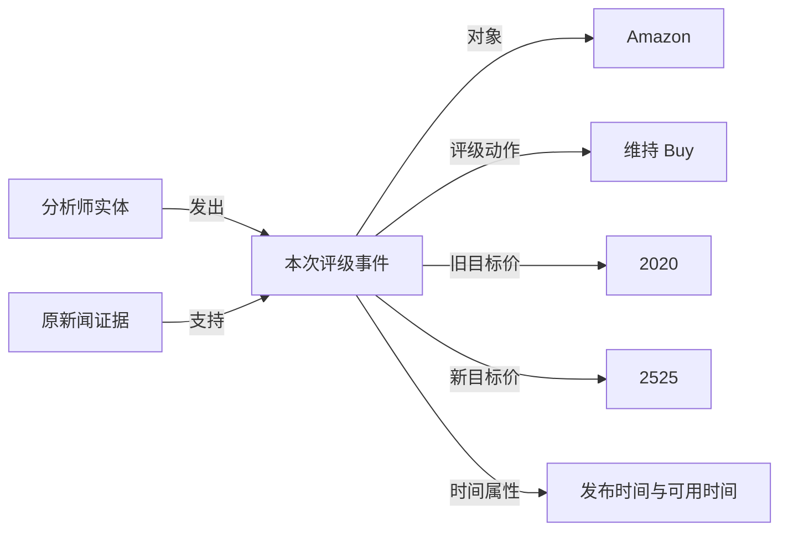

# 为什么尚无稳定提升，以及下一轮怎样设计

**最终测试状态更新（E12）：** 随后已按用户授权完成最终测试，结果见[最终测试报告](stock_final_test/REPORT.md)。下文保留E12之前的实验记录；“最终测试未评价”描述当时状态。

2026-09-15。面向 CSE 573 股票方向预测课程项目。

**后续执行更新：** 本文保留当时的诊断与设计状态；随后已完成 E09 统一基线/全文/共享/早停、E09-C 校准、E10 窗口 LoRA、E11 正则化对照及 code review 修正。实际结果见 [本轮总报告](EXPERIMENT_PROGRESS_20260915.md)，持续记录见 [项目日志](PROJECT_LOG.md)。

**本轮完成：** 复核 E04–E08 实验、阅读原论文、在 Canvas 核对相关课程主题，新增只读的监督/时间/模型互补性诊断，并更新项目日志。**本轮未做：** 新的微调、知识图谱预测、完整论文模型或融合训练；最终测试仍未评价。下面的新方法均为设计建议。

## 1. 判断：当前证据最支持哪些解释？

最有依据的判断是：**当前新闻表示与“一小时后的实际方向”之间的对应关系较弱，加上监督规模和时间稳定性限制，已有模型未能学到可重复的预测关系。** 这不是已经分离出的单一根因，也不是已估计出的数据预测上限。

| 层面 | 已观察到的事实 | 能支持的解释 | 不能推出的结论 |
|---|---|---|---|
| 监督与容量 | 每股约 1,000 个训练窗口；小 MLP/GRU 训练 BA 73%–79%，验证约 49%–53% | 有明显训练/验证差距，增加复杂度需谨慎 | 不能证明“所有深度模型都无效”，也不能只归因于参数量 |
| 输入与事件 | 标题漏掉目标公司信息；E05 目标摘录会选中旧财报、历史走势；E07 抽取质量失败 | 当前输入/组件确有具体问题 | 抽取更准后，价格一定更好预测 |
| 时间与任务 | 输入过去 4 小时新闻，预测截止后一个小时的开收方向；收益反应时点未核对 | 已反映的信息、长期信息可能与目标时段不匹配 | 市场已完全定价，或一小时涨跌不可预测 |
| 数据分布 | AMZN 9/10 月涨跌比例、新闻覆盖、波动大小均变化；模型月间成绩变化大 | 时间外推和样本变化需要检查 | 已识别造成下降的具体市场机制 |
| 评估精度 | 验证每股 252 窗口、42 个共享交易日，多轮开发复用；多数差值区间跨零 | 小幅增益难与波动区分，存在开发选择偏差 | “没有显著提升”等于“证明完全没有效果” |

BA 指上涨、下跌召回率的平均；总猜同一类得到 50%。这里的结果均为开发验证结果，不能和最终测试成绩混用。

### 1.1 模型已经能拟合，但拟合没有转移

来自 [E08 完整报告](stock_temporal/REPORT.md) 的同输入比较：

| 模型 | AAPL 验证 BA | AMZN 验证 BA | AAPL / AMZN Brier |
|---|---:|---:|---:|
| 当前价格＋FinBERT LR | 49.99% | 50.84% | 0.2599 / 0.2555 |
| 六快照扁平 LR | 50.79% | 53.58% | 0.2551 / 0.2598 |
| 同输入 MLP | 51.90% ± 1.33 | 50.80% ± 2.49 | 0.2969 / 0.3059 |
| 同输入 GRU | 49.39% ± 1.07 | 52.63% ± 1.16 | 0.3208 / 0.2964 |

“±”是三个种子的 BA 样本标准差，单位百分点，不是置信区间。常数 0.5 的 Brier 为 0.25。神经模型更高的概率误差与训练/验证差距相呼应。

此前神经训练固定 40 轮，无早停、无 dropout，只试三个 weight decay。它是一次有限的结构比较，**没有充分优化神经网络训练流程**。值得补的是训练期内部早停、概率校准和更强约束的受控比较；不能因这次失败就推断已达到神经方法上限。校准可能改善 Brier，但不一定改善方向 BA，二者必须分别报告。

### 1.2 新闻数量不能当成监督数量

本轮 [新诊断](stock_signal_audit/README.md) 确认：

| 训练统计 | AAPL | AMZN |
|---|---:|---:|
| 预测窗口 / 交易日 | 996 / 168 | 1,004 / 168 |
| 新闻记录 | 4,640 | 375 |
| 有新闻的窗口比例 | 99.30% | 56.67% |
| 跨窗口重复使用的记录 | 3,767 | 306 |
| 重复记录中同时对应过涨、跌窗口的比例 | 79.29% | 78.43% |

例如一篇 10:00 的新闻进入几个后续窗口，而价格先涨后跌，这是正常现象。给这篇文章复制多个相反标签，然后按“独立文章分类”训练，会丢掉事件年龄与价格背景。正确的监督单位应保留整个预测窗口。上述比例不是标签错误率，也不应用于删掉“矛盾文章”。

相邻窗口共用新闻与价格，两只股票又共享日期；合并后 2,000 行不等于 2,000 次独立市场情景。本轮没有估计有效样本量。

### 1.3 语气、目标公司事件、未来价格是三个不同问题

已审阅案例中，AMZN-104 的汇总标题没有表达正文中 Amazon 维持 Buy、上调目标价的事实；另一些 E05 摘录则把持仓变化换成旧财报背景。[案例证据](stock_diagnostics/QUALITATIVE_REVIEW.md)、[后续失败诊断](EXPLORATION_REPORT.md)。这说明目标与主事件识别仍有改进空间。

同时，正确理解“利好”也不能直接等同于“下一小时涨”。一个纯说明例子：利润增长 10% 听起来正面，如果新闻明确写分析师预期增长 20%，信息含义就不同。真实样本没有给预期时，不能让模型或人工补造预期。

[FinBERT 原论文](https://arxiv.org/html/1908.10063) 的主要监督是金融句子的情绪标签；它不是基于本项目小时股价训练的预测器。冻结模型有效利用了已有金融语言知识，但并未自动完成我们的目标适配。

### 1.4 目标时段可能错过新闻反应：重要假设，尚待检验

当前方向目标为目标小时 `收盘 > 开盘`，代码存储的收益数值为 `收盘 / 开盘 − 1`，在目标开始前 5 分钟作预测。此前这里写为 log return，其方向符号相同，但数值口径现按实际代码更正。例如使用 10:00 的新闻预测 10:30–11:30；如果主要价格变化已在 10:05 发生，当前目标不会记录那段反应。隔夜新闻在开盘价中的变化也不包含在开盘到一小时后收盘的标签里。

这能解释为什么新闻理解准确仍可能预测失败，但目前只有逻辑假设。应先做训练期事件时间诊断：检查可靠时间戳和事件去重，比较事件到达前后不同区间的变化，按事件/日期聚合，核对反应是否集中在预测截止前。所有分组规则在看对应后果前固定；观察反应模式不等于证明新闻造成价格变化。新闻可用时间仍须遵守现有发布时间/抓取时间检查。

E04 已实际补过最新 5 分钟价格，仍未获得稳定改善。因此，“更新价格”不能再次被包装成尚未尝试的答案。事件时间诊断也不自动授权改标签或挑一个分数最高的预测周期。

### 1.5 时间稳定性有直接数据支持

AMZN 9 月 → 10 月：上涨比例 55.26% → 44.20%；新闻覆盖 76.32% → 58.70%；目标绝对收益中位数 0.280% → 0.591%；序列 LR 的 BA 63.17% → 44.01%。

这里包含标签、输入分布和成绩同时变化，但只有两个月，不能估计哪个变化解释多少下降。可在训练期比较扩展窗口与一个事先固定的滚动窗口，核对衰减和校准；不能看到 10 月下降后专门为它改参数。89/504 个验证目标绝对收益小于 0.1%，其他样本也没有强表现，所以不能简单把全部问题归咎于微小涨跌。

## 2. 数学上能做什么？先说明作用条件

### 2.1 一个直觉：高噪声下，模型复杂并不保证方向容易预测

以一个说明用模型写未来收益：

\[
r = s(X)+\varepsilon,\qquad \varepsilon\mid X\sim N(0,\sigma^2).
\]

`s(X)` 是输入中可预测的部分，噪声是这个简化模型中未被解释的部分。若我们恰好知道 `s(X)`，预测它的符号，条件正确概率为：

\[
P(\text{方向正确}\mid X)=\Phi\!\left(\frac{|s(X)|}{\sigma}\right).
\]

若信号只有噪声标准差的 5%，这个值约 52%。这是高噪声为什么会让方向判断困难的直觉，**不是对本数据噪声、BA 或预测上限的估计**，也没有证明高斯假设适用于股票数据。

改进因此有三种途径：输入保留更多真正相关信息；在有限监督下更稳定地学习；让训练目标与任务匹配。增加层数只改变其中一部分。

### 2.2 优先尝试：共享规律、保留每股差异的 LR

现在两股分别训练。可以让它们共享一部分参数，避免每股都从少量窗口学习全部规律，同时允许差异：

\[
p_{i,t}=\sigma\big((\beta+u_i)^\top x_{i,t}+b_i\big),
\]

\[
\mathcal L=\sum_{i,t}\operatorname{BCE}(y_{i,t},p_{i,t})
 +\lambda\|\beta\|_2^2+\mu\sum_i\|u_i\|_2^2.
\]

`β` 是共享规律，`u_i` 是股票自己的修正，`b_i` 是偏置，`σ` 把分数变成概率。较大的 `μ` 限制单股模型偏离共享规律。这借鉴 [正则化多任务学习](https://flora.insead.edu/fichiersti_wp/inseadwp2004/2004-11.pdf) 的共享参数思想，以上是本项目的 LR 设计，不是原论文逐项复现。

同样输入比较三种共享程度：分别训练；仅共享斜率而保留股票偏置；共享参数加受约束的单股修正。标准化与超参数只由训练折拟合，两股按日期一起划分。原模型必须重跑为同信息、同训练预算的对照。

可能的好处是降低估计波动；如果两股关系不同，强行共享会负迁移。不能因为两股同期相关就认定它们应该共用预测系数。它成本较低，值得在微调或图网络前做。

### 2.3 图正则化：图可以是约束，不一定是大网络

若多个任务之间有可信的相似关系，可加：

\[
\mathcal L_G=\mathcal L+
\frac{\lambda_G}{2}\sum_{i,j}A_{ij}\|u_i-u_j\|_2^2
=\mathcal L+\lambda_G\operatorname{tr}(U^\top L U).
\]

这里 `A` 是事先定义、对称且非负的关系权重，`L=D-A`，`U` 的每一行是一个股票的修正参数。直觉是让图上相似任务不要学出毫无必要的巨大差异；图拉普拉斯平滑的经典依据见 [Belkin 等](https://jmlr.org/papers/v7/belkin06a.html)，这里把思想用于任务参数，而不是照搬其样本图算法。

**对目前只有两只股票的情况，这基本只是控制两组参数接近的强度，拓扑很有限。** 应与上面的共享 LR 比较，不应把两节点 GNN 当成自动更高级的方案。竞争、供应关系也不保证系数相似；不满足假设的图会加错约束。图关系只能用训练期或当时已知资料构造。

### 2.4 辅助目标可以帮助训练，但先明确它增加了什么

StockNet 的时间辅助预测是可借鉴的独立组件。若未来另做一轮，可将当前损失与过去快照的预测损失组合：`L = L_current + α * mean(L_past)`。每个过去预测只能读它自己截止前的信息；所有辅助标签必须来自训练范围，不得用验证/测试标签更新参数。

收益假设是让中间表示学习可重复的规律；它增加监督约束，但不增加独立历史市场事件。同一历史目标在多个序列重复出现时，要按出现次数归一化，避免把中间日期过度加权。先把当前目标的早停训练做好；辅助头、注意力与变分隐变量不要同一轮全加。当前还没有这个实验。

## 3. FinBERT 微调：值得一次受控尝试，先确定标签

**状态：我们只做了冻结情绪概率和冻结隐层表示，没有再次微调 FinBERT。** 发布者对模型做过的训练，不等于我们已经做了微调实验。

### 两种完全不同的微调

| 方式 | 监督是什么 | 回答的问题 |
|---|---|---|
| 目标公司情绪/事件适配 | 经人工复核的句子、角色、情绪或事件标签 | 模型是否更准确读懂目标公司信息？ |
| 股票方向适配 | 每个预测窗口真实涨跌 | 文本表示是否更适合我们的小时方向任务？ |

现有 40 条助手事件判断不是情绪训练集，也不是独立金标准。不能把它们直接当可靠的 FinBERT 情绪微调数据。若优先预测表现，可使用已有窗口级标签做弱监督的联合模型。

### 推荐的窗口级实现

1. 沿用目前原始标题输入，显式标出目标公司；不要同时接入未验收的 E05 摘录或 E07 输出。每条文章附到达年龄，由聚合器使用。
2. 编码窗口内文章，先固定等权聚合，空窗口用零向量和无新闻标记；和现有价格特征一起预测。
3. 每个窗口计算一次涨跌损失，梯度从窗口传给其文章表示。不要把窗口标签复制成若干独立文章标签。
4. 冻结编码器与低秩微调使用同一输入、同一表示维度、同一聚合和小预测头。这个冻结基线需要重建；不能仅拿旧 PCA16 或三维情绪结果比较，否则同时改变了多个因素。

\[
h_{i,t}=\operatorname{Pool}_{a\in B_{i,t}}
  f_\theta(\text{target}=i,\text{text}_a,\text{age}_{a,t}),
\quad p_{i,t}=\sigma(w_p^\top x_{i,t}^{price}+w_n^\top h_{i,t}+b_i).
\]

实现时年龄可放在池化器，而无需写成文本；公式只表示保留年龄信息。若计算成本需要文章上限，按预先固定的到达规则截取，两个模型采用相同文章，并报告覆盖变化。

建议固定一个小秩（例如 `r=4`）、先只在最后两个编码层的注意力投影加入 LoRA，主干其余权重冻结，比较冻结与 LoRA。最终层范围和学习率预算在运行前登记，不进行大规模组合搜索。[LoRA](https://arxiv.org/abs/2106.09685) 用 `W = W0 + BA` 限制可训练更新的秩；它减少可训练参数，不会把 2,000 个窗口变成更多独立监督，也不保证克服过拟合。

训练折内部保留按时间排列的末段作早停；6/7/8 月各折的评价月份保持在拟合之外。最后按训练期规则确定轮数，在 1–8 月重训，再报告 9–10 月。固定三个随机种子；记录 train/validation BA、Brier、学习曲线、新闻/无新闻覆盖、额外计算成本。现有最终测试继续封存。

**进入条件：** 冻结基线与梯度/窗口监督检查通过；同样文章不因模型不同而改变；保存所有种子。**停止条件：** 只缩小训练差距、改善情绪准确率、或只有某个种子好，都不作为方向预测成功证据。全参数微调暂不优先。

## 4. Graph：两个不同的方向

### 4.1 更适合当前数据：有证据和时间的实体—事件图

当前失败案例集中于谁做了什么、谁是评价对象、哪个数字是当次变化。这与文本知识抽取直接相关。本轮补读的 [Ding 等，COLING 2016](https://aclanthology.org/C16-1201/) 把实体关系背景纳入事件表示；其思路比直接把两股接成 GNN 更贴近此问题。前一篇 [IJCAI 2015 事件预测论文](https://www.ijcai.org/Proceedings/15/Papers/329.pdf) 也强调参与者与动作的区分。我们尚未复现它们的表示学习系统。

以“某分析师维持 Amazon 的 Buy，目标价由 2020 调至 2525”这个已审阅事实为例，用事件节点保留关系和时点：

图不是“维持 Buy 就一定涨”的规则。它保留主体、动作、对象、变化与时间，让后续分类器判断有没有预测关系。其他实体可以是分析师、基金、产品、竞争公司；所以即使只有两个预测目标，事件图也不只有两个节点。

**最小实现：**

- 先只覆盖评级调整与持仓变化两类可核查事件；保存原文证据、目标公司角色、当前/回顾性质、数字变化、可用时间。没有证据的属性留空，未知事件回退原标题。
- 先取得一小份经组员独立复核的训练期质量集，按真实事件分组，并另留未用于修规则的检查部分；继承原质量门槛，不用当前失败的 E07 输出批量建图。
- 第一版用简单文件/内存图存节点与边，不需要数据库系统。历史推断只能使用截止前已出现的节点和边；不能用后来的转载或当前知识库事实改写 2018 年图。
- 先从图读少量明确特征：目标是发起方/对象、事件动作、变化方向、独立证据数量、事件年龄。沿用小 LR，控制维数。
- 公平比较 **同一批抽取事实的平面特征** 与 **增加关系聚合/图路径特征**。如果只是把同样字段画成图而预测输入不变，就没有“图算法收益”。

质量检查重点是角色和当次变化，不只计算 JSON 合法率。两类事件未覆盖的全部窗口仍保留。只有角色/关系特征在训练期控制实验显示价值，才值得增加一层关系消息传递，并与同信息的无图聚合器比较。

### 4.2 多股票关系图：现阶段只能做很小的前置验证

RSR 的 [Temporal Relational Ranking](https://arxiv.org/abs/1809.09441) 利用行业、供应关系等做股票排序；[CausalStock](https://proceedings.neurips.cc/paper_files/paper/2024/file/54d689d58fe54c92aee2d732fc49fca8-Paper-Conference.pdf) 联合新闻表示与多股票的时滞关系预测日方向。这些不是在我们的两股、小时标签上得到的结论。

本轮实际检查：两股**同一目标小时**收益相关系数为训练 0.570、开发验证 0.735。但用截止前已结束的过去小时：AMZN → AAPL 为训练 0.041、验证 −0.002；AAPL → AMZN 为 0.054、−0.007。见 [完整诊断及限制](stock_signal_audit/README.md)。

这说明“常一起涨跌”和“能用过去的另一股预测下一小时”是两个问题。第一种相关强，不能在截止时访问另一股的未来收益。第二种简单相关弱，也没检验全部滞后或非线性，不能证明所有图模型无效。

合理前置对照是：自己的价格 → 自己＋另一股截止前价格，用 LR 检验增量，再比较关系模型。若以后扩到多股，需要事先固定股票集合，取得同年价格和当时可获得的关系资料。不能按验证表现选择股票，或把今天的行业/供应关系直接当成 2018 年已知事实。多股历史采集不是当前必要前置。

“因果图”还要求额外识别假设。只有观测收益、未控制共同市场因素时，预测有效或出现时滞关系也不证明因果；本项目优先称为关系模型，不承诺发现股价变化原因。

## 5. 完整论文系统是否值得试？

### Alostad & Davulcu：先补新闻主干的忠实程度

老师论文的新闻主干包括正文清理、词干化、二值 n-gram、特征选择、稀疏 LR；公司句抽取用于公司情绪。我们做过标题/短正文改编，卡方 top500 也不是原论文两阶段 Chi2 的逐项复现。可补一个**更贴近论文的新闻分支**，明确每项一致和差异，采用当前安全时间切分作为课程主评价。

原文的完整路线还用历史 Twitter 提及量突增及所链接新闻筛选预测情形，并报告 10 折评价。它与我们保留无新闻时段的按时间验证不同，不能直接拿论文分数作目标。目前没有匹配的历史 Twitter 流，现有新闻数不能冒充 Tweet 突增。[原论文 §3–4](https://journals.sagepub.com/doi/pdf/10.3233/WEB-170349?download=true)。

建议：新闻分支值得有限补齐；Twitter 分支只有真实历史数据可用时再考虑。全文、词干化、特征筛选一次只明确检验一项或登记一个固定的论文式组合，配原输入/同容量对照；不能在已有验证月份挑最好预处理。即使做了新闻分支，也写“改编/部分复现”，除非所有关键差异确已对齐。

### StockNet：辅助目标可考虑，完整变分系统暂不优先

其公开数据为 88 股、日频，并去掉了约 38.72% 的小幅目标；与我们的两股非平盘小时任务不同。[原论文 §2–3](https://aclanthology.org/P18-1183.pdf)。E08 的 GRU 只是时间模型组件，不代表完整 StockNet。更合适的下一组件是上文的训练约束或辅助目标；当前不同时增加潜变量、注意力和完整变分推断。不要复制去掉小幅目标的做法后把结果称为原任务提升。

### CausalStock：未实现的部分不能当成已经失败

原文包含五维 LLM 新闻评分、时滞图学习和预测模块；我们只做过简化提取小样本，且质量未通过。这没有否定原系统，也不足以支撑直接在本数据上拼接完整框架。优先验证可靠的事件信息；多股图的前提另行处理。[原文 §4](https://proceedings.neurips.cc/paper_files/paper/2024/file/54d689d58fe54c92aee2d732fc49fca8-Paper-Conference.pdf)。

## 6. 能否组合？需要可用的互补，而不只是模块更多

当前价格 LR 与标题 FinBERT LR 的错误相关性两股都约 0.72。序列 LR 与 GRU 的错误更不同，但固定诊断种子下的改对和改错几乎相抵。组合可能有价值，也可能稀释较好的分支；尚未运行融合实验。

推荐的最终结构候选是：**小型共享价格/文本预测器，允许加入一种经过验收的文本改进**。若角色图和微调分别都值得保留，再做四格消融：

| 对照 | 微调 | 角色/关系特征 |
|---|---|---|
| B | 无 | 无 |
| B＋F | 有 | 无 |
| B＋G | 无 | 有 |
| B＋F＋G | 有 | 有 |

四格使用相同原始文章、样本、时间切分、训练预算；文本抽取质量仍单独评估。若组合没有超过其中最好的单项，就保留更简单的方法。如果做概率融合，采用预先固定等权或训练期向前折样本外预测学习非负权重；不能在 9–10 月挑权重。简单平均的 Brier 有凸性性质，但不保证超过最好的分支，更不保证 BA 提高。

## 7. 与课堂知识如何对应

本轮在 [Canvas 课程安排](https://canvas.asu.edu/courses/272889) 直接核对主题，不把安排中的所有内容称为已经上过的课，也未声称重新读完这些讲义。

| 课程列出的主题 | 本项目的具体对应 |
|---|---|
| Knowledge Graphs；Knowledge Graph Extraction from Text/Web | 公司实体消歧，事件角色、证据与时点，新闻噪声处理 |
| Classification：Decision Trees、NB、Regression | 简单预测器、特征与损失、正则化、同信息基线 |
| Clustering；Community Detection | 转载归并与事件聚合；多股场景可讨论关系社区，但当前不必硬加 |
| FOIL and Rule Mining | 可审阅的事件规则；抽取规则不是“某事件一定涨”的交易因果规则 |
| GNN & GNN-RAG | 在有关系信息和合适对照时讨论消息传递；课程安排为 10 月 21 日，不能说已经完成相关课堂学习 |
| Sentiment & Scaling Analysis | FinBERT 情绪与股票方向任务的区别，特征尺度与有限监督 |

课程提供知识工具，不要求把所有主题堆入一个项目。完整系统演示、传统/现代方法对照、报告和成员贡献仍是交付重点，[项目要求核对](PROJECT_SCOPE_CHECK.md)。

## 8. 我的优先级与执行边界

| 顺序 | 建议 | 解决的具体问题 | 本轮状态 |
|---|---|---|---|
| 0 | 固定主任务与最终候选上限；整理学习曲线、事件时点和训练期诊断 | 防止目标漂移、确定性能瓶颈 | 监督/时间分布诊断已做；事件反应诊断未做 |
| 1 | 补一个明确登记的老师论文新闻分支；比较共享/独立 LR | 基线忠实度与小样本估计波动 | 设计完成，未运行 |
| 2 | 一次窗口级 FinBERT 冻结 vs 小 LoRA，内部早停，三种子 | 表示未针对小时任务适配 | 设计完成，未运行 |
| 3 | 有独立质量复核后，做两类事件的角色图＋LR | 目标混淆和关系缺失；课堂特色 | 设计完成，未抽取/训练 |
| 条件性 | 有价值的单项之间做一次组合；或另选一个时间辅助目标 | 判断互补或训练约束 | 不同时启动全部分支 |
| 后置 | 完整 Twitter 系统、全参数微调、多股 GNN、完整 StockNet/CausalStock | 需要额外数据和验证预算 | 当前不推荐作为主线 |

如果只能选择一个现代方法改进，我会先选择**窗口级小规模微调**，因为它直接检验任务适配且可使用现有监督；如果优先突出本课知识抽取与解释，选择**小型事件角色图**，但必须先通过内容质量检查。两个方向可以作为先后候选，不需要为了“结合论文”全部完成。

新增模型参数继续仅用训练期向前折决定；目前开发月份已影响本计划，必须公开这点。保留无新闻窗口、保持原覆盖。按股票/月报告 BA、MCC、Brier，描述性配对日期区间承认日期依赖和模型选择限制。不会预先保证有几个百分点的增益。

**停止规则：** 再进行最多两轮针对性预测改动后，如果仍只有个别月份或种子改善，就收敛为基线＋一个现代方法＋负结果解释，完成演示与报告。先前的负结果足以支撑消融分析；老师并没有规定必须靠堆复杂模型取得某个准确率。
