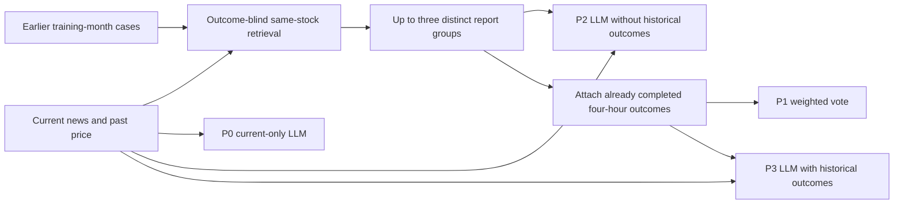

# Historical news/outcome analogy (four hours)

Read [initial protocol](PRE_REGISTRATION.md) and the outcome-blind
[V2 amendment](V2_REGISTRATION.md). V1 was stopped for misleading input retrieval;
its private scores and source snapshot are preserved without prediction evaluation.
V2 keeps all original windows and compares P0/P1/P2/P3, with exact fallback.



Current labels are evaluation-only. The historical outcome attachment happens after
case selection. All methods retain windows with missing news through explicit fallback.

```sh
work/stock-data/finbert-env/bin/python outputs/stock_analogy_4h/prepare.py
work/stock-data/finbert-env/bin/python outputs/stock_analogy_4h/verify.py
work/stock-data/structured-env/bin/python outputs/stock_analogy_4h/infer.py
work/stock-data/finbert-env/bin/python outputs/stock_analogy_4h/report.py
work/stock-data/finbert-env/bin/python outputs/stock_analogy_4h/verify.py
work/stock-data/finbert-env/bin/python outputs/stock_analogy_4h/cases.py
```

Requires original private course prices, audited P1 paragraph packs, the fixed
1,607-window prepared table, saved foundation baseline predictions, and pinned local
Qwen3.5-9B MLX model. This is frozen inference, not training/fine-tuning. No paid API.
Historical cases contain only matured earlier-training-month outcomes; query labels
are not in prompts. All periods are exposed retrospective backtests.

Private inputs, text, prompts, maps, weights and partial logs stay in
`work/stock-data/analogy_4h`. Preparation rejects mismatched fingerprints. Inference
resumes an identical append-only log by rerunning the same command; no explicit
resume flag is needed. Completed output fingerprints are validated by verification.
Change the hardcoded run paths to a new version for a changed experiment. Never
delete prior runs to force a rerun.
