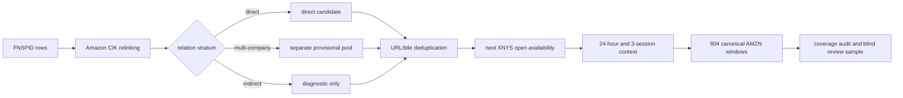

# FNSPID Amazon candidate-coverage audit (v3)

## Plain-language result

FNSPID can materially reduce the *input coverage* gap for Amazon, but the
result is not yet permission to train a stock predictor. The corpus contains
many Amazon mentions, especially multi-company articles. The narrower
direct-target stratum is useful enough to review; the multi-company stratum is
too dense to trust without semantic validation.

No stock label, return or saved prediction was used. No classifier was fitted.

## What was implemented

Every relevant row has date-only timing. A record dated on day `d` is first
available at the next XNYS regular open strictly after `d`. This prevents the
system from treating a date-only article as a same-day intraday event.

## Source and candidate counts

The task-aligned source period is 2017-12-01 through 2019-02-01.

| Mechanical relation claim | Edge rows | Deduplicated groups | Groups with body |
|---|---:|---:|---:|
| Direct Amazon | 339 | 206 | 188 |
| Multi-company direct | 4,846 | 2,998 | 2,982 |
| Indirect / competitor | 2,385 | 1,475 | 1,475 |
| **Total** | **7,570** | **4,679** | **4,645** |

All 7,570 edges were generated by content-based relinking. None has a native
FNSPID ticker equal to AMZN. This is why the native ticker field is not used as
ground truth.

## Coverage of the canonical task

The course task contains 804 AMZN four-hour windows. The original course-news
pipeline has news in 415 and no news in 389.

| Candidate policy | All windows covered | Original 389 no-news windows covered | Gap recovery |
|---|---:|---:|---:|
| Direct only, prior 24 hours | 383 | 176 | 45.24% |
| Direct only, prior 3 sessions | 653 | 314 | 80.72% |
| Direct + multi-company, prior 24 hours | 746 | 350 | 89.97% |
| Direct + multi-company, prior 3 sessions | 804 | 389 | 100.00% |

The last row is a warning as much as a result. Multi-company candidates have a
median of 26 groups per window in the three-session view. Such density can come
from market summaries, portfolios, rankings and repeated syndicated material;
it does not prove 26 new Amazon events.

## Review pack

A deterministic 120-group review manifest was frozen before semantic labels.
Private source extraction recovered a title and normalized evidence context for
all 120 cards; the matched alias is present in 117. The remaining three are
retrieval/normalization cases that must be inspected, not silently discarded.

Current state:

- semantic labels completed: 0;
- independent reviewers: 0;
- independent precision claim: none;
- private article text committed: no.

## What this result means

**Observed:** FNSPID contains enough mechanically linked Amazon material to
change the coverage problem. Direct-only candidates fill 45% of original news
gaps in the 24-hour view and 81% in the three-session view.

**Not established:** that every candidate is truly about Amazon; that it is new
information to the market; that the text improves four-hour direction; or that
the multi-company pool is safe to use.

## Frozen next step

1. Blindly label the 120 cards as direct target, multi-company direct,
   indirect/counterparty, incidental, no evidence or uncertain.
2. Report precision separately for direct and multi-company strata. Do not
   combine them to hide poor precision.
3. If direct-target precision is adequate, build a separately preregistered
   candidate feature experiment. Treat FNSPID as prior context, never as a
   precisely timed intraday event.
4. Use strict routing:
   - original current news available: keep the existing full-text model and add
     only validated historical-context features;
   - no original current news but validated FNSPID context exists: compare a
     price baseline with a small context correction;
   - neither exists: exact price-model fallback.
5. Keep direct and multi-company features separate. Multi-company input enters
   only if its own review quality passes.

## Verification

The fit-free verifier passes source hashes, public artifact hashes, 804 unique
canonical keys, 389 original gaps, next-session availability, no future links,
deduplication, the 120-card freeze, private review-pack hash/counts and zero
prediction activity. See `VERIFICATION.json`.

