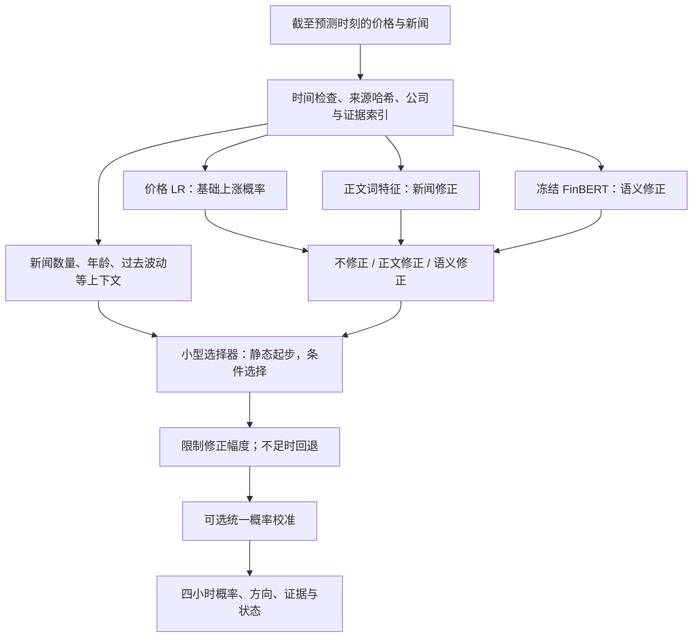

# 四小时股票预测：下一版完整实施方案

版本：2026-09-15，方案 v1。状态：**方案已制定，以下新实验尚未实施或训练**。

## 1. 最终要做成什么

构建一套同时用于 AAPL 和 AMZN 的四小时预测系统：先由价格模型给出基础判断，再由新闻提出有限的修正；系统根据当时的信息决定采用多少修正。没有新闻、证据不足或选择器不可靠时，明确回退。

课堂主线可以用一句话解释：**新闻是否包含价格之外的增量信息，以及如何避免不可靠的新闻修正损害基础预测。**

目标不是预设两股都必须达到某个分数。工程必须完成，是否存在跨月收益由实验回答。不会按已看到的后续成绩写死“苹果用 FinBERT、亚马逊用全文”。

### 固定范围

- 主任务：同一交易日内，起点开盘至四小时后收盘的方向；48 根完整五分钟线。截止点仍为起点前五分钟。
- AAPL / AMZN，保留既有 1,607 个分类窗口、原标签和分割。四小时新闻回看窗口继续按可用时间定义。
- 训练期 2018 年 1—8 月；9—10 月和 11 月以后的结果分开报告。全部时期已参与过设计，统一称为探索性历史回测。
- 不删除无新闻、微小涨跌或预测困难的窗口。平盘与缺线沿用原清单，不为涨分改变清单。
- 免费优先，保存旧实验。核心部分本地 CPU；冻结 FinBERT 复用核验后的缓存。
- RL 交易属于已有独立问题；本轮不拿交易收益代替四小时方向指标，也不自动重跑无关旧实验。

## 2. 为什么是这个方案：问题与机制一一对应

| 已观察到的问题 | 本轮处理 | 必须验证的限制 |
|---|---|---|
| 原四分支都含价格，价格/标题预测高度相似 | 价格只建模一次，新闻学习增量 | 相关性不是错误；残差结构不保证优于有效的联合模型 |
| 静态融合会把正确分支拉错 | 加入“不修正”、静态修正、条件修正对照 | 选择器可能比原模型更容易过拟合 |
| 全文词关系随时期变化，训练分数明显高于后续 | 限制词数、正则化；单列过去误差更新 | 更新不能提前知道新的市场状态 |
| 标题与正文动作冲突、公司对象混杂 | 公司—动作—证据—时间关系，原文回退 | 抽取准确不等于可预测；独立质量验收仍缺失 |
| AMZN 新闻少，部分窗口根本没有新闻 | 检查原始语料与过滤漏检；无新闻严格回退 | 不能凭代码创造缺失新闻 |
| 上涨偏向与高置信错误 | 单列校准，报告上下涨跌召回与 Brier | 校准未必改善方向 BA |
| 少量、相互重叠的窗口 | 按完整日期前向验证、限制层数、配对日期块区间 | 不能把 499 行训练数据当成 499 次独立行情 |

证据见 [诊断报告](../diagnosis/FINDINGS_AND_NEXT_PIPELINE.md)、[覆盖统计](../diagnosis/coverage_shift.csv)、[案例卡](../diagnosis/CASE_CARDS.md)。目前核验的训练规模是每股 499 行、167 个日期；已有实验真实训练过，见 [训练复核](../diagnosis/training_verification.json)。这些是旧结果的证据，不是本方案的新成绩。

## 3. 完整流水线



关系抽取先作为可追溯的信息层。质量通过后才改变预测输入；因此核心实验不必等待人工复核。

### 3.1 一个价格底座

沿用原 16 个价格特征与 L2 逻辑回归：

\[
q_t=\sigma(b+\beta^\top x_t).
\]

所有新增新闻分支共享同一个、在当前训练截点冻结的价格模型。主试验在当前训练范围内按前向验证选 `C ∈ {0.01, 0.1, 1}`；没有更早验证记录的暖启动月份固定 `C=0.1`。

### 3.2 新闻只学习价格之外的修正

两个修正器都不再次输入完整价格特征：

\[
\delta_{b,t}=u_b^\top z_{b,t}+c_b,
\qquad
\delta_{s,t}=u_s^\top z_{s,t}+c_s.
\]

- 正文：现有清洗与词干处理，二值词袋，折内卡方保留 **100 个词**。
- 语义：现有冻结 FinBERT 标题向量，**唯一训练文章上 PCA16**，再按窗口等权聚合。没有新闻时向量置零并显式使用无新闻标记。
- 两个修正器分别使用 L2，`C ∈ {0.01, 0.1, 1}`，不与更多维度或编码器同时做笛卡尔搜索。
- 将 `logit(q_t)` 当作固定输入分数（offset），通过分类损失训练修正量；不是直接回归 `label − q_t` 后随意加到概率上。
- offset 必须来自当时尚未见过该行标签的价格模型。不得用价格模型在自身训练集上的概率训练修正器。
- 修正截断固定为 `[-1, 1]` 个 log-odds 单位，用于每一次候选 OOF 评价和实际推断；拟合仍优化未截断的凸 logistic 目标，避免截断平坦区导致梯度消失。明确记录这项训练/输出区别，以及未截断值和截断触发率。这是本轮控制极端修正的工程常数，不是已经验证的最优值。

为避免正则化实现含糊，offset 优化器明确采用：`sum(log_loss) + ||u||²/(2C)`，截距单独记录是否惩罚。匹配的“允许价格再修正”对照使用同一损失、样本键、特征变换和正则化约定。历史 liblinear 模型保留原实现，另列历史参照；不能声称不同求解器/截距约定下的同名 C 完全等价。

### 3.3 先静态控制，再条件选择

令 `g_t=1` 表示有合格可用新闻，反之为 0；三个选择分别是零修正、正文修正和语义修正：

\[
p_t=\sigma\left(\operatorname{logit}(q_t)+g_t\,[w_{b,t}\delta_{b,t}+w_{s,t}\delta_{s,t}]\right),
\quad w_{0,t}+w_{b,t}+w_{s,t}=1,
\quad w_{j,t}\ge0.
\]

这里的 `w0` 是“不让新闻介入”的权重。权重混合的是修正量；没有给每个分支再复制一遍价格预测。它不能保证新闻与价格统计上独立，只是明确限制参数和信息路径。

**第一步：静态权重。** 三个权重以 0.25 为步长，共 15 组，包含全部不修正和两个单新闻分支。每股只根据过去完整流水线的样本外预测选择。

**第二步：低容量条件选择器。** 用过去样本外预测学习每个新闻分支相对价格的 Brier 损失差：

\[
d_{j,t}=(y_t-p_{j,t})^2-(y_t-q_t)^2.
\]

线性 Ridge 预测该差值。负值代表预计能帮助价格模型。两股共享主要参数，加一个受正则化的股票偏置，避免每股另建一套复杂路由器。

首版限定 8 个上下文量：

1. `log(1 + 新闻数)`；
2. 已知发布时间年龄的中位数，经 `log1p` 变换；
3. 发布时间未知比例；
4. 截止前的历史价格波动；
5. 价格概率距 0.5 的距离；
6. 两种新闻修正的差异绝对值；
7. 两种修正是否同方向；
8. 纽约时间的预测起点小时。

公司相关性、模板比例尚未验收，首轮不伪装成可信特征。年龄缺失使用当前训练集的中位数填补，并保留未知比例。上下文缩放只拟合过去数据。

固定决策：Ridge `alpha ∈ {1,10,100}`；预测损失差截断到 `[-1,1]`，通过温度固定为 0.05 的 softmax 生成三个权重；再向静态权重收缩，动态占比只比较 `{0,0.25,0.5}`。不额外搜索温度、网络层数、隐藏维度。

使用以下回退：

- 没新闻：新闻修正严格为零。
- gate 历史数据不足：沿用静态权重。最低为两股合计 200 条完整链的样本外预测、60 个共同日期；单股还需 30 个有新闻窗口、20 个有新闻日期。实施时先计算是否满足，不倒推放宽。
- 多个上下文维度明显超出训练范围：回退静态权重。首版固定为 8 项中至少 3 项超出训练期 1%—99% 分位区间；保存触发原因。这是工程防护，不是分布外可靠性的证明。
- 选择器不通过验证：最终保留静态修正或原 baseline，不强行加入。

## 4. 正确的 training：每一层都必须在“过去预测未来”

最大的实施风险是：第一层没泄漏，选择器却用第一层的训练内成绩学习。必须保存分层时间账本。

### 4.1 月度账本

以六月为例，六月的任何标签不能用于六月的词表、PCA、C、修正器、gate 或校准。

1. 一月作为暖启动；从二月开始尝试生成价格前向预测，训练只用更早完整日期。没有至少 40 行且两类齐全时不拟合，不伪造 OOF。
2. 从具备至少 60 条价格 OOF、20 个日期、两类齐全的月份开始拟合新闻修正器。此前只能输出价格回退，并标记为暖启动。
3. 三月至五月等历史月份的新闻预测，要由各月当时的过去价格 OOF 训练修正器产生。不能在五月训练一个修正器后，回头预测三月并称其为 OOF。
4. gate 只读取上述完整链真正样本外的预测、当时上下文和已经实现的标签。先预测，再写入误差账本。
5. 所有层级必须满足：用于拟合的最大 `label_end` **早于**被预测行的 `cutoff`。按两股共用的完整交易日期划分；有跨边界重叠时清除重叠标签。
6. 整个六月预测完成后，才能用于七月之前允许的更新。后层模型的超参数只能由它自己更早的滚动预测选择，不能选完再回报同一段选择成绩为泛化成绩。

各层缺少更早选择月份时使用固定暖启动：价格/修正 `C=0.1`，静态组合为零修正，Ridge `alpha=10`、动态占比 0.25。样本门槛仍必须满足；暖启动默认值不能越过门槛。各层在同一月份先生成预测，月底才将候选误差加入下一月选择账本。

外层汇总仍以六、七、八月为主。某方法因暖启动/门槛未能运行的月份，报告实际回退成绩和状态；机制本身另报有效覆盖，不能只保留它成功启动的月份抬分。

### 4.2 最终冻结回放与在线回放分开

**冻结主试验：** 全部规则和参数选择截至八月底；九月之后分支、gate 参数和校准映射都冻结。gate 可以根据当时新闻/价格上下文输出不同权重，但不能读取九月后的预测误差或标签。这是条件适应，不是在线再训练。

**在线扩展：** 单独试验，只在下一交易日首次预测前使用已经结束的四小时标签。先固定价格/新闻分支，只更新专家权重，避免把多项改变混在一起。九月后的已实现标签成为允许的信息，必须给所有在线对照相同权限。

价格模型最终在全部允许历史上重拟合，修正器学到的却是较早模型产生的 OOF offset，二者存在训练分布差异。记录各月价格校准和 offset 分布变化；不要把这种合法但实际存在的差异当成已消除的问题。

参考：[scikit-learn 时间序列交叉验证说明](https://scikit-learn.org/stable/modules/cross_validation.html)。本项目还需自行实现标签结束时间检查与多层前向账本，直接套普通随机 K 折不够。

## 5. 实验矩阵：从机制到完整系统

### N00：数据合同与 baseline 重现——必做

保存 1,607 行样本/标签/截止时间合同，重现旧 baseline 与旧四小时组合的保存预测。核验缓存的文本、模型 revision、tokenizer、截断、池化和文章键。沿用旧 artifact，不改写旧报告。

**三个参照层次：**

- 常数 0.5 概率：BA 50%（两类齐全且固定阈值时）、Brier 0.25；再列只按过去类比例输出的常数模型。
- 价格 LR：检测新闻是否有增量。
- **主课程 baseline：价格＋标题 TF-IDF＋L2 LR**，沿用旧定义与三个 C 的过去选参。它是本项目的经典 ML 参照，不声称课件指定了这套精确实现。

旧完整融合和正文/语义单分支作为重要历史对照。另列按过去 OOF 选择的单分支，不能以回放赢家替代这个选择流程。

### N01：共享价格底座与新闻修正——必做

| 编号 | 输入/机制 | 检验什么 |
|---|---|---|
| R0 | 价格底座 | 新系统的精确回退参照 |
| R1 | 底座＋正文修正 | 正文是否有独立增量 |
| R2 | 底座＋语义修正 | 语义是否有独立增量 |
| R3 | 底座＋静态修正组合 | 两类信息能否互补 |
| J1/J2 | 与 R1/R2 相同，但允许再学习价格修正系数 | 收益是否来自锁定价格参数，而非其他差异 |

J1/J2 与 R1/R2 使用完全相同的 residual 训练键、offset、文本变换、C 网格和拟合目标；唯一主要差异是允许价格系数再变动。旧 500 词联合模型仅作历史参照，不能把 500→100 的容量变化归因于 offset。

若新闻修正无增量仍报告 R3；不自动扩大词数或换编码器。小容量 PCA8 / 正文25只允许作为一次有明确过拟合证据的后续版本，不与 gate 大网格交叉。

### N02：条件选择器——做一个受控版本

运行 R4：在 R3 的相同修正器上加入上一节的小型 gate。与 R0/R1/R2/R3 和过去选优的单分支比较。

必须报告：选择器相对 R3 改对/改错的数量、新闻介入强度、使用零修正的比例、无新闻回退率、门槛不足和异常上下文回退率。若没有有效 meta-training 数据，完成实现和测试，但状态为 `INSUFFICIENT_HISTORY`。

即使全期间 gate 没提升，也不能只展示它偶然获胜的股票或月份。

### N03：概率校准——单列，不能与 gate 收益混淆

对 R0、R3、R4 提供校准关闭/开启对照。首版使用一个共享的单调映射：

\[
\mathcal C(p)=\sigma(a\operatorname{logit}(p)+b),\quad 0.5\le a\le2,\quad |b|\le0.5.
\]

映射仅用过去价格 OOF 拟合，损失为平均 log-loss 加固定的 `0.5*((a-1)^2+b^2)`，不搜索校准强度；同一映射用于同股的 R0/R3/R4。这样校准对照不会暗中为各分支追加不同预算，也保留 `无新闻 → C(q)` 的精确回退。

这只检验一个低容量的共享概率修正，不代表每种融合结果已分别达到最优校准。若校准改善 Brier 却降低 BA，清楚记录取舍，不自动换主目标。

### N04：AMZN 覆盖与关系输入——诊断必做，预测接入有条件

**先定位缺失来源：**

1. 在每个原截止点以前的原始新闻中，比较标题命中、正文直接目标、比较对象、顺带提及四类。
2. 保存从原始记录到当前入选文章的逐步数量与拒绝原因，按股/月分解。
3. 新增候选按确定性抽样审阅，阅读时隐藏未来收益；不把正文出现 Amazon 当成直接事件。
4. 若确有可靠漏检文章，建立独立 `coverage_expansion` 输入分支，保持 1,607 标签窗口不变。与原文章集合做配对对照，不能悄悄改主实验缓存。

**Semantic Web 的具体实现：**

保存文章、公司、事件、证据句、事件组与时间属性，以 JSONL/本地 RDF 文件即可，无需数据库服务器。区分 `mentionsCompany` 和 `eventTarget`；评级动作与目标价动作分开；保存证据字符位置、原文哈希、发布时间、可用时间、期间与未知字段。历史知识只取新闻在当时明确给出的内容，不从当前知识图回填 2018 年信息。

抽取优先修复已知的对象错配、维持评级/目标价下降混淆、标题正文冲突、历史评级列表、单位和期间不一致；矛盾不能可靠消解时保留冲突状态并回退原文。机构未知时为空。

**质量与覆盖分开验收：**

- 现有 40 篇组员独立复核仍是待办，不能由助手标签替代。
- 新规则另留按近似事件组隔离的检查样本，检查材料隐藏未来价格。检查集一旦用于改规则就转为开发材料，另补检查样本。
- 每个正式使用的关系/事件类型至少 30 个非重复检查例，关键字段 ≥90% 正确率，另报覆盖、漏抽、弃权率和区间。样本不足时保持未验收。
- 已有 40 篇是起点，不保证覆盖每种类型；不删除失败字段后声称完整方案通过。

**质量通过后才做 Q0/Q1/Q2：**同一文章集合、同一最大 token 数、同一冻结编码器，比较标题、正文开头、目标证据片段。证据失败均回退标题，保存标记。先固定同一种下游修正器，不同时重调 gate；若输入有稳定增量，再把该输入接入完整流水线，重新生成全链 OOF 后比较集成效果。

新增文章先不自动合并事件。近似转载归并作为独立可选对照，只使用过去信息，保留报道次数。不能把抽取、扩覆盖和去重一次全改后归功于某一项。

免费外部数据调查最多投入两小时，检查许可、历史正文、可用时间和小时/分钟价格能否可靠对齐。找到合格新时期后，先按日期锁定最后至少 60 个共同交易日为新保留期，再查看其标签或设计特征。若拿不到合格数据，明确记录，继续现有历史回测；不转用收费服务，不用日频价格冒充小时数据。此前已经浏览过的新数据也不再具有未暴露保留期资格。

### N05：有限的在线更新——后做、独立成表

只更新权重的第一版：固定 20 个已完成交易日的平均 Brier，先日内取平均，再跨日取平均，向训练期误差收缩（20 个“先验日”等效权重）；沿用温度 0.05 和固定 50% 向静态权重收缩。每天更新一次，不搜索回看天数。

比较冻结静态组合、过去误差权重、条件 gate。若以后重拟合 gate，也只能用当时生成的真实历史预测误差，不能用重训模型回算旧误差。

同时给标题 baseline 和价格 baseline 一个只更新校准截距的简单适应版本，使用相同已经实现的标签。说明这些方法获准使用的信息一致，但更新形式不同；不能只拿在线模型打冻结 baseline 来证明算法本身更好。

### N06：高级方法——本轮不自动进入

- 完整 GNN：独立抽取质量通过、≥100 个非重复有效事件并覆盖 ≥60 个交易日以后，才比较相同事实的普通聚合与一层关系传播。图存储完成不等于 GNN 有效。
- 注意力、可学习投影、LoRA：只有简单新闻增量在训练期至少两个月有一致收益时，再注册至多一个版本；与等信息、相近参数量的简单模型比较。
- SPY/QQQ 过去行情：可靠免费分钟数据能对齐时，给 baseline 和新方法同时增加，另列实验。
- 连续四小时收益辅助目标：不改主分类标签，只有明确需要时另立协议；不因小收益难预测而删除它们。
- 不复现完整 StockNet 变分结构，不扩展新的 RL 搜索，也不因本轮没涨分自动增加大型模型。

## 6. 怎样决定“好”，而不是只挑一个高分

### 6.1 指标

主指标：逐股、逐月 BA 及两股等权月均 BA。同步报告 MCC、Brier、上涨/下跌召回、预测上涨比例、样本数、新闻覆盖和常数预测比例。

有/无新闻、发布时间年龄、微小/较大收益和不同预测小时只作诊断。收益幅度分层阈值在训练期确定，不能用于过滤主分数。

### 6.2 有限选参规则

每层只用更早的完整月份：先要求月均 Brier 不比其匹配参照恶化超过 0.002，再按月均 BA 选择；并列时选更低 Brier、更强正则化、更小动态占比。没有合格候选则回退。

阶段是否值得继续：在六、七、八月中至少两个月优于匹配参照，两股等权平均 BA 增加至少 1 个百分点，且任一股票月均 BA 不下降超过 1 个百分点、Brier 不恶化超过 0.002。**这只是预先固定的预算筛选线，不是统计显著性，也不能保证两股独立泛化。**

这些月份若参与最终配置选择，其成绩须标注“训练期前向选择记录”；不得同时称为未用于选择的最终证据。完整九月后回放按冻结协议统一输出，不看完一部分就换配置。

### 6.3 最终结果的用语

- “工程完成”：运行、追溯、测试、demo 完成，哪怕没有收益。
- “历史回测有增量”：多个时期支持、保留全部失败与对照；仍受反复探索影响。
- “稳定泛化提升”：需要未来或另一个未用于设计、预先锁定的时期确认，当前材料不足以保证。

两股后续 BA 都高于 50% 是希望看到的现象，不是充分证据。必须比较同样样本上的价格和新闻 baseline，说明差值不确定性。

使用 10,000 次共同日期配对重采样，五日块为主、单日和十日块为敏感性。保持同一天两股和所有重叠窗口在同一重采样单元。区间是探索性描述，不做未经选择校正的显著性宣称。

## 7. Case study 要怎样补齐

保留已审阅的 16 窗口/29 篇节选，标记为已用于设计的诊断材料。新增固定抽样规则：两股 × 两段回放 × 四种对错关系 × 最多 4 个不同日期，共最多 64 窗口；不足的类别全部取，不用重复事件补数。

四类为新方法相对主 baseline：改对、改错、共同错误、共同正确。每张卡包括基础概率、两种修正、gate 权重、最终概率、回退/校准状态、新闻证据、实际收益、对象/时间/模板问题及“不确定”的解释。

另分析所有发生方向改变的窗口数量和类别，再人工读代表案例，避免仅选择好看的案例。用“将某修正置零后预测怎样变”解释模型路径；不把模型依赖或新闻与价格的同时出现说成因果关系。

## 8. 实现接口、证据与必要测试

拟新增目录 `outputs/stock_adaptive_4h/`，沿用独立不可覆盖的运行目录。下面是待实施接口，不是已经可执行的命令。

```text
data_contract.py          四小时样本与信息截止合同
temporal_ledger.py        分层 OOF / 标签成熟 / 过去选参
features.py              原价格、正文100词、冻结向量PCA16
offset_model.py          固定基础分数的修正与同容量对照
router.py                静态权重、条件损失预测、回退
calibration.py           共享单调概率映射
coverage_audit.py         AMZN 原始覆盖与过滤损耗
evidence_relations.py    公司—动作—证据—时间及质量状态
run.py                   prepare → train → evaluate → report
predict.py               无标签端到端推断
report.py                主表、逐月、区间、案例与成本
tests/                   信息时间和关键机制测试
```

每个 run 保存输入/代码/环境/模型哈希，模型 revision，全部训练和评价键，价格 OOF / 修正 OOF / gate OOF 账本，候选及选择理由，所有权重与逐窗口概率，拟合开始结束/PID/优化器迭代/收敛状态/耗时，阶段失败与回退原因。

必要测试：

1. 任一未来新闻、未完成价格线、未实现四小时标签被拒绝。
2. 价格层/修正层/gate/校准每层训练来源可递归追溯；篡改未来标签不会改变此前输出。
3. 无新闻精确返回基础概率；开校准时精确返回同一映射后的基础概率。
4. 新闻零修正恒等、固定 offset 优化与一个可手算小例一致；梯度数值检查与截断边界检查。
5. gate 权重非负和为 1、静态收缩/不足回退/异常上下文回退正确。
6. 标题内容、模型版本或编码配置改变导致缓存拒绝；恢复执行重新验证全部来源和质量状态。
7. 已知抽取错误回归测试通过，不把 schema 验证等同语义验收。
8. 保存后去掉标签进行完整推断，概率误差 ≤1e-10 且方向完全一致。
9. 按日块配对重采样保持同日重叠样本与两股关联；单类月份的 BA 标记不可计算而不是填高分。

本地工作区目前不是 Git 仓库，因此本轮方案采用文件 SHA256＋代码快照做版本证据；若后续初始化 Git，也不替代数据/缓存指纹。

## 9. 交付顺序与停止条件

| 批次 | 必须交付 | 下一步条件 |
|---|---|---|
| A | N00 合同、匹配 baseline、分层账本 | 时间与缓存测试全部通过 |
| B | N01 残差/单新闻/静态完整流水线、J 对照 | 先得到完整可运行结果，不停在零散组件 |
| C | N02 一版小 gate、N03 校准、完整消融 | 数据不足则回退并报告，绝不借后续标签凑 gate 训练 |
| D | N04 覆盖审计与抽取修复、组员复核表 | 验收通过才跑关系输入；否则保留原文分支 |
| E | N05 独立在线回放、满足条件的完整输入组合 | 给在线 baseline 相同已实现标签 |
| F | 冻结候选、复现说明、报告、案例与离线 demo | 最多 baseline＋两个候选用于新的未暴露时期 |

第一版核心最终必须展示 **baseline → 单新闻修正 → 静态组合 → 条件组合 → 可选校准** 的完整结果。关系输入以后通过验收，要再做最终集成，不把它永远留在单独小实验里。

相同机制至多两个有针对性的版本；连续无收益就停止扩网格。任何已观察的后续成绩启发新版本时，登记新的探索版本。不得把先前表现好的旧周期、旧股票子集偷偷替换为最终目标。

核心模型无需 Sol。文章新编码先测一个小批次，只有估计超过两小时或内存不足才安排 Sol；本方案不预先声称已经提交集群。独立复核缺失不阻塞 N00—N03、覆盖诊断和课程交付，只暂停正式关系/Graph 分支。

若触发高级神经分支，本轮只进入一个机制，三个固定种子，训练期内部早停，合计最多 8 GPU 小时；达到预算后保留完成与失败记录，不按最好种子汇报。

## 10. 论文与课堂知识具体用在哪里

| 依据 | 本轮用途 | 不应夸大的地方 |
|---|---|---|
| 词袋、卡方、正则化 LR；指定 Alostad & Davulcu 路线 | 传统 baseline、正文小容量分支、可解释词权重 | 不称完整论文复现；缺失 Twitter 数据不伪造 |
| [FinBERT](https://arxiv.org/abs/1908.10063) | 冻结金融文本语义表示 | 情绪任务迁移不保证四小时方向可预测 |
| [Arbitrage of forecasting experts](https://link.springer.com/article/10.1007/s10994-018-05774-y) | 依据预计损失选择专家，考虑专家依赖 | 本轮借鉴公开摘要中的机制，不宣称复制其完整实验/算法 |
| [Ding 等 2016](https://aclanthology.org/C16-1201/) | 实体与事件关系、对象与动作表示 | 关系组织不等于已证明 GNN 能涨分 |
| 信息抽取、实体消歧、证据溯源 | 分清 target 与 mention、保留动作/期间/证据 | 格式合法不是语义正确 |
| stacking、时间序列验证、偏差—方差取舍 | 分层样本外学习、低容量 gate、固定有限搜索 | 多层组合会减少可用监督并增加误差来源 |

另需披露：FinBERT 论文发表于 2019 年，当前冻结编码器属于事后可获得的表示工具。我们使用它研究历史数据，不能声称这套模型在 2018 年当时已可部署；仅做监督标签的时间隔离也不能证明预训练语料与历史评估文章完全无重叠。现阶段没有证据量化这种影响，报告模型版本与这一边界。[FinBERT 原论文](https://arxiv.org/abs/1908.10063)

## 11. 最终报告与 demo

主结果表固定包含：标题 baseline、价格 baseline、旧完整融合、正文修正、语义修正、静态修正、条件修正、选定完整系统；每行同时列两股 BA/Brier、逐月稳定性、相对主 baseline 的差值与区间。校准和在线更新各自另表，所有尝试保存在附录。

离线 demo 输入股票和一个历史截止点，显示：当时允许使用的价格/新闻、目标四小时区间、基础概率、新闻修正、选择权重、最终概率、证据来源、抽取与回退状态。真实未来结果只在用户选择“回放解释”后显示，不进入预测函数。

每一步更新 `outputs/PROJECT_LOG.md`：为什么做、实际改了什么、实际训练了什么、分数与数据怎样变化、哪些解释成立、哪些仍是推测、是否继续。

**最终建议：先把 N00—N03 做成一条真正训练并可推断的四小时系统；同时补 N04 的覆盖与质量证据。只有可靠的新输入和简单机制有增量，才再加在线或高级机制。任何阶段失败，都交付可复现结果与解释，不以增加复杂度代替证据。**
